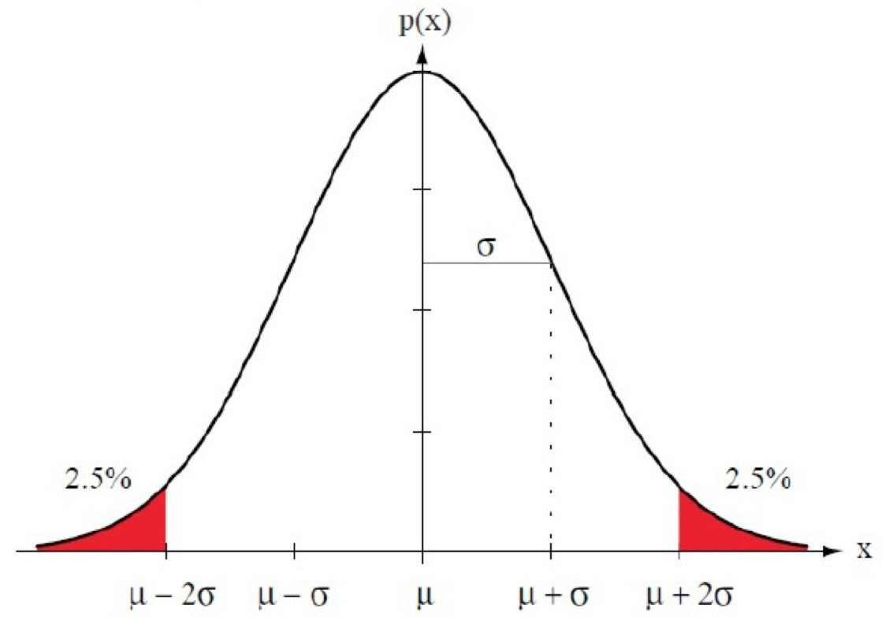
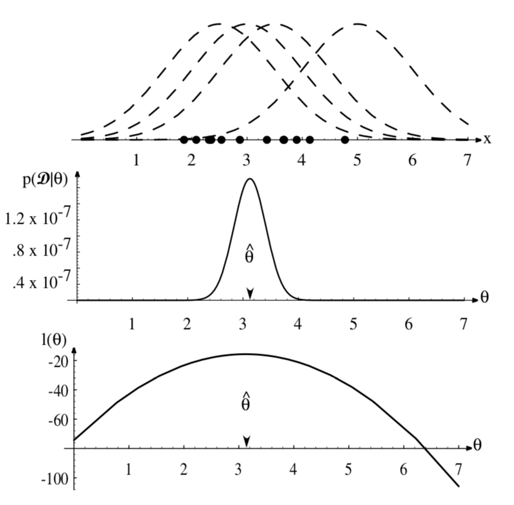

# Gaussian Decision Functions

We make assumptions about the distribution of samples data is Gaussian. In reality it can take any distribution, however many has proven to be gaussian. The central limit theorem tells, that aggregating a large number from a lot of small independent disturbance will turn out to be gaussian.

When sampling a variable a lot of disturbance is collected as well. The expected value of a continuous variable can be determined as;

$$\varepsilon[f(x)]=\int^{\infin}_{-\infin}f(x)p(x)dx$$
The normal distribution $p(x)$ is given by:

$$p(x)=\frac{1}{\sqrt{2\pi} \cdot \sigma}e^{-\frac{1}{2}(\frac{x-\mu}{\sigma})^2}$$

For discrete variables of set $D$, it can be expressed as;

$$\varepsilon[f(x)]=\sum_{x\in D}f(x)P(x)dx$$

where $P(x)$ is the Probability Mass Function (PMF) of $x$.

$$p(x)=\frac{1}{\sqrt{2\pi} \cdot \sigma}e^{-\frac{1}{2}(\frac{x-\mu}{\sigma})^2}$$

$\mu$ is the mean and $\sigma$ is the standard deivation.

$$\mu=\varepsilon[x]=\int^{\infin}_{-\infin}x\cdot p(x)dx$$

$$\sigma^2=\varepsilon[(x-\mu)^2]=\int^{\infin}_{-\infin}(x-\mu)^2\cdot p(x)dx$$

The following model visualizes the normal distribution. 95\% are within 95\% of the interval of $2\mu + \sigma$ (i.e. confidence interval).

Normal distribution are also denoted $\mathcal{N}(\mu, \sigma^2)$.

## Multi-variate normal distribution

In higher dimensions, we have a $D$-dimensional vector $x$; $$x = \begin{bmatrix}
    x_1 \\
    \vdots \\
    x_D 
\end{bmatrix}$$
The normal distribution is denoted $\mathcal{N}_k(\mu, \sigma^2)$, where $p(x)$ can be expressed as;

$$p(x)=\frac{1}{(2\pi)^{\frac{D}{2}}|\Sigma|^{\frac{1}{2}}} e^{-\frac{1}{2}(x-\mu)^T\Sigma^{-1}(x-\mu)}$$

where $\Sigma$ is the covariance matrix, that is defined as;

$$\Sigma=\varepsilon[(x-\mu)(x-\mu)^T]=\int (x-\mu)(x-\mu)^Tp(x)dx$$

$\Sigma$ can be calculated using 1D operations.

$$\Sigma_{ij}=\varepsilon[(x_i-\mu_i)(x_j-\mu_j)]$$

$$\Sigma=\begin{bmatrix}
\Sigma_{11} & \dots & \Sigma_{1D} \\
\vdots & \ddots & \vdots \\
\Sigma_{D1} & \dots & \Sigma_{DD}
\end{bmatrix}$$

The covariance matrix have some important properties;

- $\Sigma_{ii}$ is the variance of dimension $i$.
- $\Sigma_{ij}$ is the covariance of $i$ and $j$.

1. If $\Sigma_{ij}=0$ for $i \ne j$, then $i$ and $j$ are statistically independent.
2. If $\Sigma_{ij}=0$ for $i \ne j$, then the multi-variate normal distribution degenerates to the product of $k$ normal distributions.

It can often be used to define a decision function taking into account the different scaling of the various dimensions and theri co-variance.  

$$d_m(x-\mu)=(x-\mu)^T\Sigma^{-1}(x-\mu)$$

**Data Whitening**
Is a linear transformation with a whitetning matrix $W$, that transforms a vector of random variables $X$ with a known covariance matrix into a nex vector $Y$ whose covariance matrix is the identity matrix, meaning the data are uncorrelated and each have a variance of 1. 

Eigenvalues decomposition:

$$\Sigma = U\Lambda U^T$$

Where $U$ is a matrix whose column are formed by the eigenvectors and $\Lambda$ is a diagonal matrix with the corresponding eigenvalues.

There are infinitely many option of $W$. Commonly used are ZCA i.e. Mahalanobis whitening;

$$W=U\Lambda^{-\frac{1}{2}}$$

The transformation can be denoted;
Wikipedia:
$$Y=WX$$ 
Alexandros:
$$Y=W^TX$$

The transformations has much resemblance with PCA. It is an linear transformation using eigen vectors. PCA is an orthogonal transformation, thus rotating the data. PCA uses $W=U\Lambda$. 

PCA can be used to reduce the dimensionality. Whitening is used to remove correlation in data by shrinking large data direction and expanding small directions. Large data directions tend to reflect low spatial frequencies, thus whitening can increase spatial precision. Whitening separates data by expanding small dimension assuming all the dimensions are of equal importance.

## Decision Functions
Consider a two-class classification problem:
$$p(x|c_1)\sim \mathcal{N}(\mu_1, \Sigma_1)$$$$p(x|c_2)\sim \mathcal{N}(\mu_2, \Sigma_2)$$ Using Bayes' rule, we will;

Decide $c_1$ if $P(c_1|x)>P(c_2|x)$, else decide $c_2$.

If $g(\cdot)$ is a monotonic function, then

$$P(c_1|x)>P(c_2|x) \rightarrow  g(P(c_1|x))>g(P(c_2|x))$$

We do this to ease our calculations. We replace using Bayes formula;

Decide $c_1$ if $P(c_1|x)P(c_1)>P(c_2|x)P(c_2)$, else decide $c_2$. (note: divide by p(x) dissappears on both sides.)
or
Decide $c_1$ if $f(x|c_1)>f(x|c_2)$, else decide $c_2$.

We simplify the computation of the exponential function by $g(x)=ln(x)$, then we have;
$$f(x|c_k)=-\frac{1}{2}(x-\mu)^T\Sigma_k^{-1}(x-\mu)-\frac{D}{2}ln(2\pi)-\frac{1}{2}ln(|\Sigma_k|)+ln(P(c_k))$$

**Special Case**
In case $\Sigma_k=\sigma^2I$, the deteminant $|\Sigma_k|=\sigma^{2D}$ and the inverse $\Sigma_k^{-1}=\frac{1}{\sigma^2}I$. The decision rule then becomes;

$$-\frac{1}{2\sigma^2}(x-\mu_1)^T(x-\mu_1)+ln(P(c_1))>-\frac{1}{2\sigma^2}(x-\mu_2)^T(x-\mu_2)+ln(P(c_2))$$

**Discrete Values**
Integrals become summation;
$$\int p(x|c_k) \rightarrow \sum_x P(x|c_k)$$
Bayes' formula involves propalities instead of propability densities;
$$P(c_k|x)=\frac{P(x|c_k)P(c_k)}{P(x)}$$Where
$$P(x)=\sum_{k=1}^K P(x|c_k)P(c_k)$$

## Maximum Likelihood Estimation

We assume our collection of samples to be of a gaussian distribution and that each training sample drawn are idenpendent identical distributed (i.i.d.) random variables.  
Suppose the training set $D$ contains $n$ samples, and $\theta$ is the sample we wish to estimate. The likelihood is defined as;
$$p(D|\theta)=\prod_{k=1}^n p(x_k|\theta)$$
The estimate $\hat{\theta}$ is by definition the value, that maximizes $p(D|\theta)$. 

Figure shows all the possible distributions of the sampled data, an optimal solution and the same optimal solution option by the log-likelihood.

Taking the natural logarithm generate a monotonic function, that simplifies computations. The operation can be written as;

$$\hat{\theta}=\underset{\theta}{\operatorname{arg\ max}}\ ln(p(D|\theta))$$

It can be derived, that the mean $\mu$ and standard deviation $\sigma$ can be estimated from the collection by the general formulas.

**Univariate**
$$\hat{\mu}=\frac{1}{n}\sum_{k=1}^n x_k$$

$$\hat{\sigma}^2=\frac{1}{n}\sum_{k=1}^n (x_k-\mu)^2$$
**Multivariate**
$$\hat{\mu}=\frac{1}{n}\sum_{k=1}^n x_k$$

$$\hat{\sigma}^2=\frac{1}{n}\sum_{k=1}^n (x_k-\mu)^2$$
Typically we do not know these variables and must estimate them. 

## Baysian Estimation
We do not seek a true value for $\theta$, but a random variable instead. Training allow us to convert a distribution into a posterior porbability density.

