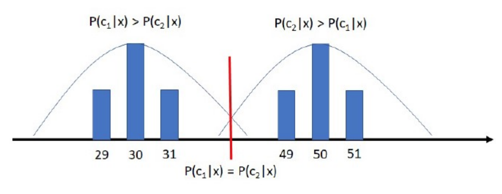

# Probability-based learning

Assuming a classification problem with $K$ possible outcomes; $$C=\{c_1...c_k\}$$
$C$ is the set of classes.

$P(c_k)$ denotes the prior probability of the outcomes.

The porobaility of all comes are denoted as;

$$\sum^{K}_{k=1}P(c_k)=1$$

We do NOT classify based on the priori, if $P(c_1)>P(c_2)$, then all would be classified as the $c_1$.

$P(c_k|x)$ denotes the conditional probability, that states the probability of class $c_k$ given the observation $x$. 

The joint probability of $c_k1$ and $x$ is
$$P(c_k,x)=P(c_k|x)P(x)=P(x|c_k)P(c_k)$$

From this we can obtain Bayes' formula

$$P(c_k|x)=\frac{p(x|c_k)P(c_k)}{p(x)}$$

The error can then be defined as $$P(error|x)=\Big\{\begin{matrix}
    P(c_1|x),  if\ x\ is\ misclassified\ to\ c_2 \\
    P(c_2|x),  if\ x\ is\ misclassified\ to\ c_1 
\end{matrix}$$

Which is given by;

$$P(error)=\int^{\infin}_{-\infin}P(error,x)dx=\int^{\infin}_{-\infin}P(error|x)p(x)dx $$

Thus, we can define Bayes' rule as decision rule:

Decide $c_1$ if $P(c_1|x)>P(c_2|x)$, else decide $c_2$.

The decision function is obtained by finding $x$ for $P(c_1|x)=P(c_2|x)$.

More than two classes??

# Risk-Based Decision Funtions

Suppose given observation $x$ , we take the action $\alpha_i$ classifying the sample to class $i$.

We define the loss function $\lambda(\alpha_i|c_k)$, which expresses the loss incurred taking action $\alpha_i$, given the correct class is $c_k$.

The risk of $\alpha_i$ for observation x can be defined as:

$$R(\alpha|x)=\sum^{K}_{k=1}\lambda(\alpha_i|c_k)P(c_k|x)$$

