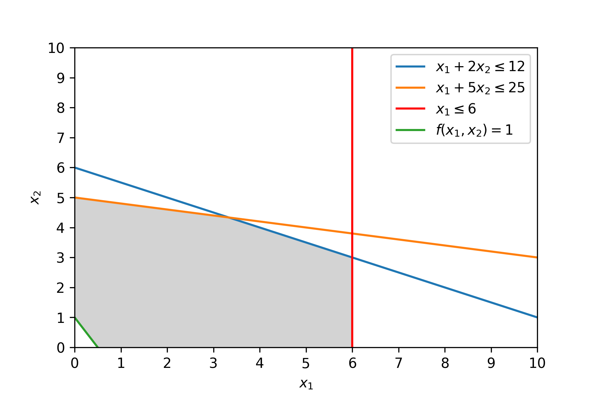
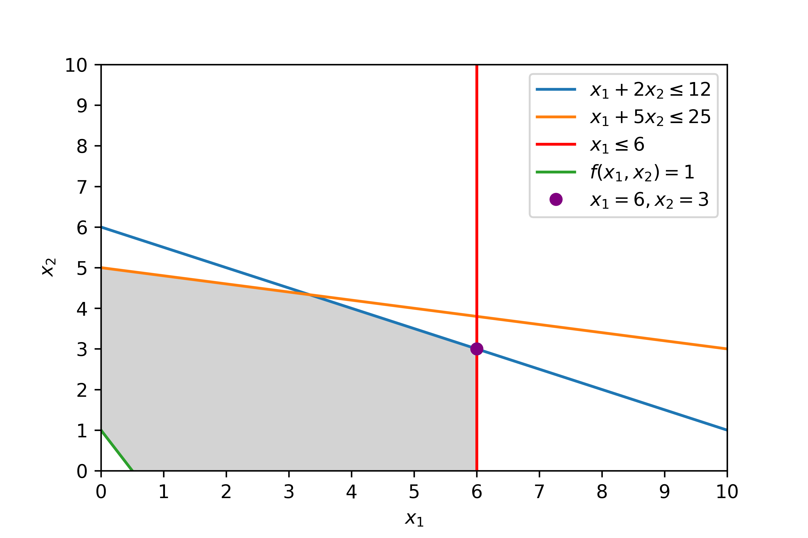
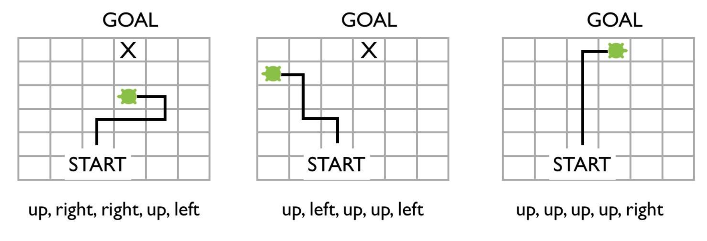
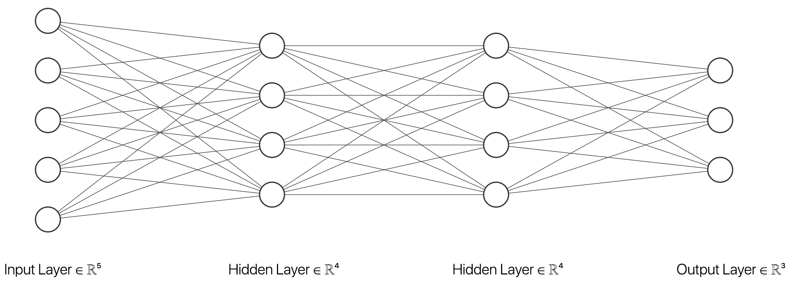
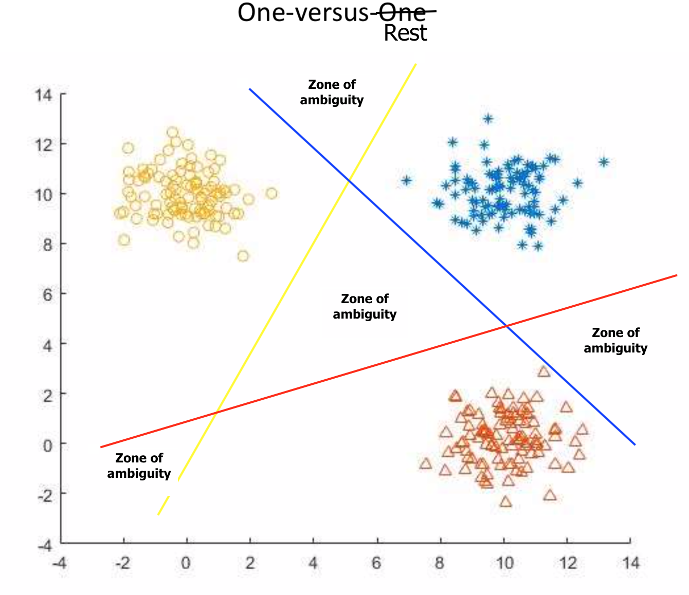
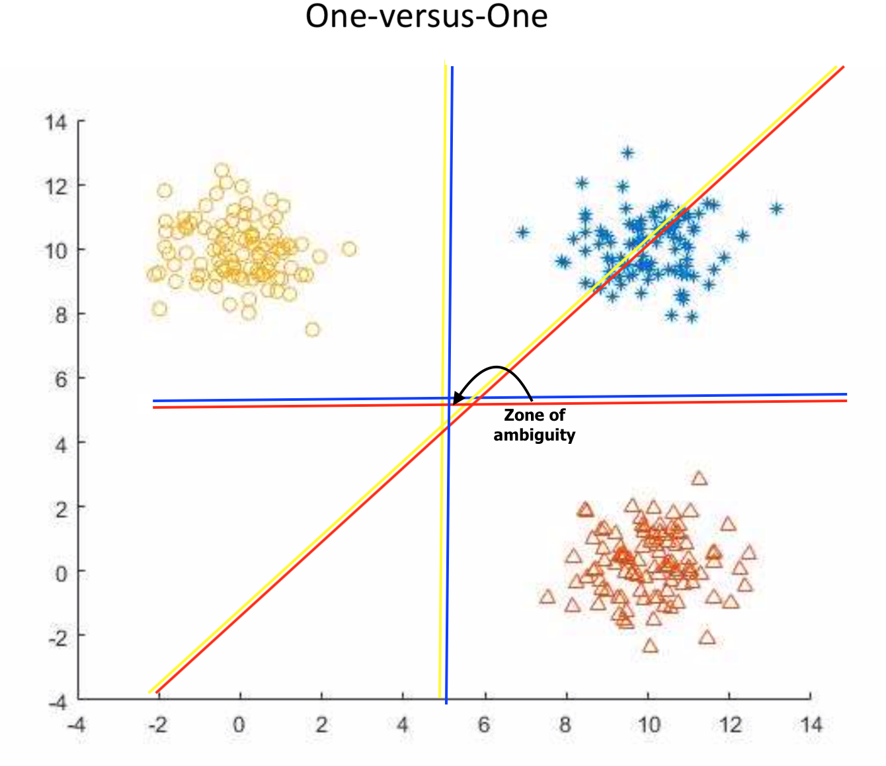

# Exercise 1

Consider the following optimization problem:

$$
\begin{aligned}
Maximize: f(x)=x_1 + x_2 \\
Subject\: to: x_1+2x_2 \leq 12 \:(i)\\
x_1+5x_2\leq25\:(ii)\\
x_1 \leq 6\:(iii) \\
and\: x_1 \leq 0;\: x_2 \leq 0
\end{aligned}
$$

a) Sketch the feasible set in 2 dimensions, including the level set: $L = {x \in -R|f(x) = 1}$.



b) Write out the simplex tableaux for the problem and show the first step needed to bring in a new variable into the solution (e.g. argue what column and row to choose, and what elementary operations are needed for the first reductions). Find the maximum for $f$ on the feasible set (you may use MatLab).

\newpage{}

> Simplex is a method for linear programming problem. It must be a **maximization** problem on standard form.
>
>- *All variables must be non-negative $\geq 0$.*
>- *Constraints should be non-negative $(\leq)$.*
>
>The objective function should have all the variables on the left-hand-side and is equal to zero e.g. $Z = 3x + 4y$ becomes $-3x-4y + Z =
0$.
>
>Simplex introduces slack variables to turn inequalities into equations e.g. $2x_1+x_2 \leq 8$ becomes $2x_1+x_2 + x_3=8$.
> **NB: Duality Theorem**
Primal Problem $P$
$$maximize\: f(x)=c^Tx\\Ax\leq b\\x\geq0$$
Dual Problem $P'$
$$minimize\: g(y)=b^Ty\\A^Ty\leq c\\y\geq0$$

<!-- A minimization problem can be rewritten as:
$$max\: f(x) = min\:-f(x)$$ -->

Once the above is satisfied the initial problem can be formulated on simplex tableau form:

|$x_1$|$x_2$|$\hat{x}_3$|$\hat{x}_4$|$\hat{x}_5$|  $y$   |
|-----|-----|-----|-----|-----|-----|-----|
|1|2|1|0|0|12|
|1|5|0|1|0|25|
|1|0|0|0|1|6|
|-1|-1|0|0|1|0|
Table 1: Initial simplex tableau

> NB. just to show how the dual problem of the initial solution should look like. $\downarrow$

|$y_1$|$y_2$|$y_3$|$\hat{y}_4$|$\hat{y}_5$|  $x$   |
|-----|-----|-----|-----|-----|-----|-----|
|1|1|1|0|0|1|
|2|5|0|1|0|1|
|1|0|0|0|1|0|
|-25|-12|-6|0|1|0|
Table 1.1: Dual problem simplex tableau

Selecting pivot element $A_{ij}$;

> The pivot column $j$ should be the largest negative i.e. smallest value of the bottom row $c$, which is the coefficients.
The pivot row should be the smallest value. The pivot row $i$ is determined by $\min(\frac{y_n}{c_n})$.  

Pivot column $j$;

$$j=\min(-1,-1)$$

both $x_1 = x_2 = -1$, $j=1$ is selected.

Pivot row $i$;

$$i=\min(\frac{12}{1}, \frac{25}{1}, \frac{6}{1})$$

$i=1$ is selected as $\frac{6}{1}=6$ is the smallest entry.

The pivot element is $A_{13}$

> Next step: All other entries in the column should be 0

Row operations;

$$R_2=R_2-R_3$$

$$R_1=R_1-R_3$$

$$R4=R_4+R_3$$

|$x_1$|$x_2$|$\hat{x}_3$|$\hat{x}_4$|$\hat{x}_5$|  $M$  |  $y$   |
|-----|-----|-----|-----|-----|-----|-----|
|0|2|1|0|-1|0|6|
|0|5|0|1|-1|0|19|
|1|0|0|0|1|0|6|
|0|-1|0|0|0|1|6|
Table 2: Simplex after first pivot

If we should continue, then;

$A_{21}$ would be the next pivot, and the following row operations;

$$R_2=R_2-\frac{3}{2}R_1$$

$$R_4=R_4+\frac{1}{2}R_1$$

$$R_1=\frac{1}{2}R_1$$

|$x_1$|$x_2$|$\hat{x}_3$|$\hat{x}_4$|$\hat{x}_5$|  $M$  |  $y$   |
|-----|-----|-----|-----|-----|-----|-----|
|0|1|1/2|0|-1/2|0|3|
|0|0|-5/2|1|3/2|0|4|
|1|0|0|0|1|0|6|
|0|0|1/2|0|1/2|1|9|
Table 3: Simplex solution

The optimal solution is then;

$$f(6,3)=9$$



Now we change inequality ii) to the following inequality: $x_1 + 5x_2\leq 30$. We keep inequality i) and iii). 

c) Does this change the maximum for $f$ on new the feasible set? Argue for your answer (try to argue without doing a new simplex tableau calculation).

It would not matter. If we look at the (a) the equation does not affect the solution, as we increase the amount, however if we did decrease it enough it would start to have impact on the feasible set, hence the solution. 

# Exercise 2

Consider the function: $f: R^3 \rightarrow R$, where $f(x)=x_1-x_2-x_3$.

a) Find the gradient of $f$ and the directional derivate in the direction $d=(2,3,4)$
(argue for your calculations).

The gradient of $f$ is $\nabla f$, which is a vector of the partial derivates of the variables.

$$\nabla f(x_1,x_2,x_3)=
    \begin{bmatrix}
    \frac{\partial f}{\partial x_1} \\
    \frac{\partial f}{\partial x_2} \\
    \frac{\partial f}{\partial x_3}
    \end{bmatrix}=
    \begin{bmatrix}
    1 \\
    1 \\
    1
    \end{bmatrix}
$$

The directional derivate in the direction d, is the dot product of $d \cdot \nabla f$.

$$d \cdot \nabla f = 2\cdot 1+3\cdot 1+4\cdot 1 = 9$$

Now let $f$ be subject to the constraint, $h(x_1,x_2,x_3)=0$, where $h(x)=\frac{x_1^2}{4}+\frac{x_2^2}{9}+\frac{x_3^2}{3}-1$.

b) Find the maximum and minimum for $f$ over the feasible set $F=\{x_1,x_2,x_3|h(x_1,x_2,x_3)=0\}$ (argue for your calculations).

To find both minimum and maximum of $f$ subject to the constraint $h$ I use the lagrange multiplier method. 

$$F(x,\lambda)=f(x)-\lambda(h(x))$$

I plug the given functions into the formula.

$$F(x_1,x_2,x_3,\lambda)=x_1-x_2-x_3-\lambda(\frac{x_1^2}{4}+\frac{x_2^2}{9}+\frac{x_3^2}{3}-1)$$

I remove the parentheses.

$$F(x_1,x_2,x_3,\lambda)=x_1-x_2-x_3-\lambda\frac{x_1^2}{4}-\lambda\frac{x_2^2}{9}-\lambda\frac{x_3^2}{3}+\lambda$$ 

I take partial derivatives with respect to each variable;

$$\frac{\partial f}{\partial x_1}=1-\lambda\frac{2x_1}{4}\Rightarrow x_1=\frac{2}{\lambda}$$

$$\frac{\partial f}{\partial x_2}=-1-\lambda\frac{2x_2}{9}\Rightarrow x_2=-\frac{9}{2\lambda}$$

$$\frac{\partial f}{\partial x_3}=-1-\lambda\frac{2x_3}{3}\Rightarrow x_3=- \frac{3}{2 \lambda}$$

$$\frac{\partial f}{\partial \lambda}=-\frac{x_1^2}{4}-\frac{x_2^2}{9}-\frac{x_3^2}{3}+1=0 $$

I rearrange the constant $1$ and substitute expressions for $x_1, x_2$ and $x_3$.

$$\frac{x_1^2}{4}+\frac{x_2^2}{9}+\frac{x_3^2}{3} = 1 \Rightarrow \frac{(\frac{2}{\lambda})^2}{4}+\frac{(-\frac{9}{2\lambda})^2}{9}+\frac{(\frac{3}{2\lambda})^2}{3} = 1$$

Use the rule $(\frac{a}{b})^2=\frac{a^2}{b^2}$ and simplifies the fraction.

$$\frac{\frac{4}{\lambda^2}}{4}+\frac{-\frac{81}{4\lambda^2}}{9}+\frac{-\frac{9}{4\lambda^2}}{3} = \frac{1}{\lambda^2}-\frac{9}{\lambda^2}-\frac{3}{\lambda^2} = 1$$

I multiply both sides by $\lambda^2$ and finally solve by the square root on both sides.

$$4=\lambda^2 \Rightarrow \lambda = \sqrt{4}$$

There are two solution for $\lambda$.

$$\lambda = 2\: \vee\: -2$$

Using back-substitution to solve for $x_1, x_2$ and $x_3$.

$$x_1=1 \: \vee\: -1$$

$$x_2= -\frac{9}{4}\: \vee\: \frac{9}{4}$$

$$x_3=-\frac{3}{4}\: \vee\: \frac{3}{4}$$

I plug in the value for the optimum and compute.

$$f(1,-\frac{9}{4},-\frac{3}{4})=1-(-\frac{9}{4})-(-\frac{3}{4})=4$$

$$f(-1,\frac{9}{4},\frac{3}{4})=-1-\frac{9}{4}-\frac{3}{4}=-4$$

The first solution is the maximum and the second the minimum.

# Exercise 3

Answer the following with ONE sentence per question.

a) What is the main difference between the Newton and Quasi-Newton method?

*Newton's method computes the first and second order derivative i.e. Jacobian and Hessian matrices. 
Quasi Newton's approximates these matrices, in cases of unavailability or if they are too expensive to compute.*

b) What is discrete optimization? Name one example of a well-known discrete optimization problem.

*Discrete optimization involves discrete variables. The travelling salesman problem, is a weel-known discrete optimization problem, that tries to optimize the best route trough a set of discrete variables i.e. cities.*

c) What is the main feature of global search methods?

*Global Search Algortithms have countermeasures to avoid getting stuck in a local optimum and seek global optimum for the optimization problem.*

d) In lectures we discussed the following optimization methods:
- Particle Swarm 
- Simulated Annealing 
- Quasi-Newton
- Newton
- Genetic Algorithms 
- Conjugate Gradient

Add these methods to the tables below according to their properties (some methods will be added to more than one table)

|Deterministic|Stochastic|Global Search|Population of candidate solutions per iteration |
|--|--|--|--|
|Newton | Particle Swarm | Particle Swarm | Particle Swarm |  
|Quasi-Newton | Genetic Algorithms | Genetic Algorithms | Genetic Algorithms |
Conjugate Gradient| Simulated Annealing | Simulated Annealing |

e) We are helping a robot turtle find some treasure. A "turtle path" always begins at the START square and consists of five steps. At each step the turtle moves one square, either: up, down, left, or right. Below are some examples of turtle paths.



We want to use a genetic algorithm to find instructions so the turtle ends up at the GOAL (where the treasure is) once it stops moving. Each "turtle path" is a candidate solution.

i) Develop a representation of a five step "turtle path" as a chromosome. Explain your representation, and give one example of a chromosome with the corresponding turtle path.

*Using two bits;
Up: 00, 
Right: 01, 
Left: 10, 
Down 11.*

*Chromosomes;*

1. (00,01,01,00,10)
2. (00,10,00,00,10)
3. (00,00,00,00,01)

ii) Suggest an objective function that gives an appropriate cost to each candidate solution such that any turtle path that ends at the goal minimizes the cost. Give the costs for the three example turtle paths in the pictures above.

*Could this be "Steps away from goal?". Then $c_1=2, c_2=4$ and $c_3=0$.*

iii) Give an example of single-point cross-over using your chromosomes (choose an example that clearly demonstrates this).

*Single-point cross-over of (1) and (2).*

(1) $00010|10010$
(2) $00100|00010$
*Cross-over point is indicated by | between index 5 and 6.*
(c) $00010|00010$

*First part is (1) second part is (2).*

iv) Give an example of mutation using your chromosomes.

*Step trough cromosome bit by bit. Randomly decide to flip with a probability e.g.  0.1%.* 

(2) $000\mathbf{0}000010$

Index 4 has been flipped indicated with bold font. 

v) Given an initial population P of size N, explain the steps of your genetic algorithm search for ONE generation (about one or two sentences per algorithm step).

```
Given initial population generation t0
1. Select intermediate population based on fitness (Selection)
2. use intermediate population to create offspring (Cross-over and Mutation)
3. population (t+1) is offspring
Repeat until stop criterion is met
```


# Exercise 4

A classification problem is formed by two classes. We are given a set of 2-dimensional data $X = [x_1,x_2, \dots x_7]$: 

$$
\mathbf{X}=\begin{bmatrix} 
0 & 1 & 1 & 3 & 3 & 4 & 4 \\ 
1 & 0 & 1 & 1 & 2 & 1 & 2\end{bmatrix}$$

each belonging to one of the two classes, as indicated in the class label vector $l = [l_1 l_2 ... l_7]$:

$$\mathbf{l} = \begin{bmatrix}1 & 1 & 1 & 2 & 2 & 2 & 2 \end{bmatrix}$$

Using the above (training) vectors and the corresponding class labels, classify the following vectors: 

$$x_8 = \begin{bmatrix}1 \\ 2 \end{bmatrix},\: x_9 =\begin{bmatrix}3 \\ 0 \end{bmatrix}, x_{10} =\begin{bmatrix}2 \\ 1 \end{bmatrix}$$
using the following classifiers:

First define data:

```python
X = np.array([[0,1],
              [1,0],
              [1,1],
              [3,1],
              [3,2],
              [4,1],
              [4,2]])

l = np.array([1,1,1,2,2,2,2])

test_data = np.array([[1,2],
                      [3,0],
                      [2,1]])
```

a) The Nearest Class Centroid (NCC) classifier

```python
clf = NearestCentroid()

clf.fit(X,l)

clf.predict(test_data)
```

$$classifications = [1, 2, 1]$$

b) The Nearest Neighbor Classifier (using only one neighbor) 

```python
clf = KNeighborsClassifier()

clf.fit(X,l)

clf.predict(test_data)
```

$$classifications = [1, 2, 1]$$

c) The Bayes-based classification scheme, where: $$p(x_i|c_k) = \frac{||x_i - m_k||_2^{-2}}{\sum_{m=1}^K ||x_i-m_l||_2^{-2}}$$
where $m$ is the class mean vector of class $c$, $k=1,2$ and $||v||^{-2}_2 = \frac{1}{v^Tv}$.

$$classifications = [1, 2, 1]$$

```python
# Defining c1 and c2
c1 = X[:3]
c2 = X[3:7]

m1 = c1.mean(0)
m2 = c2.mean(0)

pxc1 = []
pxc2 = []
for i in test_data:
    pxc1 = np.append(pxc1, (-2**(-(LA.norm(i-m1)))/
    (np.sum(-2**(-(LA.norm(i-m1))) + -2**(-(LA.norm(i-m2)))))))
    pxc2 = np.append(pxc2, (-2**(-(LA.norm(i-m2)))/
    (np.sum(-2**(-(LA.norm(i-m1))) + -2**(-(LA.norm(i-m2)))))))
```

$$P(x|c1) = \begin{bmatrix}0.69307734 & 0.35753005 & 0.53576935\end{bmatrix}$$

$$P(x|c2) = \begin{bmatrix}0.30692266 & 0.64246995 & 0.46423065 \end{bmatrix}$$

d) Compare (qualitatively) the decision functions obtained by using the NCC classifier and the above Bayes-based classification scheme.


# Exercise 5

a) Draw a neural network solving a 3-class classification problem using training data $x \in R$, $i = 1\ \dots \ N$. The neural network is formed by 2 hidden layers (having L1 and L2 neurons, respectively). For each neuron, you may or not use the bias input.

http://alexlenail.me/NN-SVG/index.html



b) Show that the use of the linear activation function (for all neurons) makes the above network equivalent to a two-layer (no hidden layers) network.

*We have the output of each layer written as; $$L_1 = W_1x, L_2 = W_2L_1, o=W_3L_2$$ We can then define the output as;$$o=W_3W_2W_1x=W_4x$$ for some matrix $W_4=W_3W_2W_1$, however the equation is the same as a two layer (no hidden layer) neural network.*

c) Based on the above, describe why it is important to use non-linear activation functions in neural networks. You can base your answer using the structure of the network in question a.

*Non-linear activation functions can produce outputs, that are not linear combinations the input. Linear activation function, no matter how many layers performs as a single-layer perceptron.*

# Exercise 6

## 3 Class classification problem

For the following two classification schemes;

- *One-versus-Rest*
- *One-versus-One*

Draw the decision function vectors $(W)$ and the zone of ambiguity.



