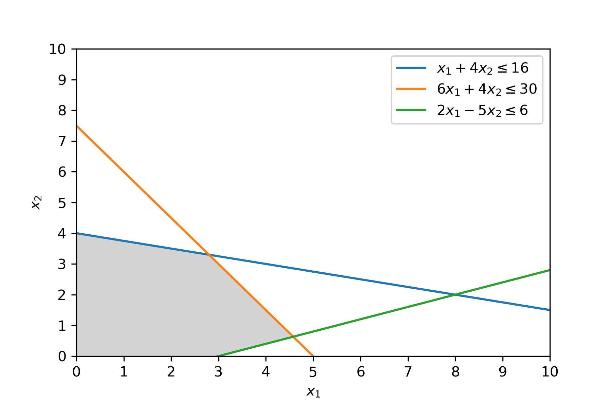
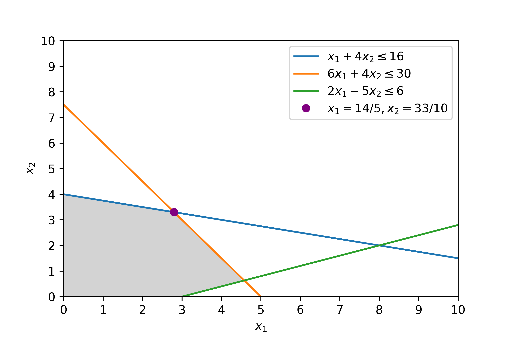
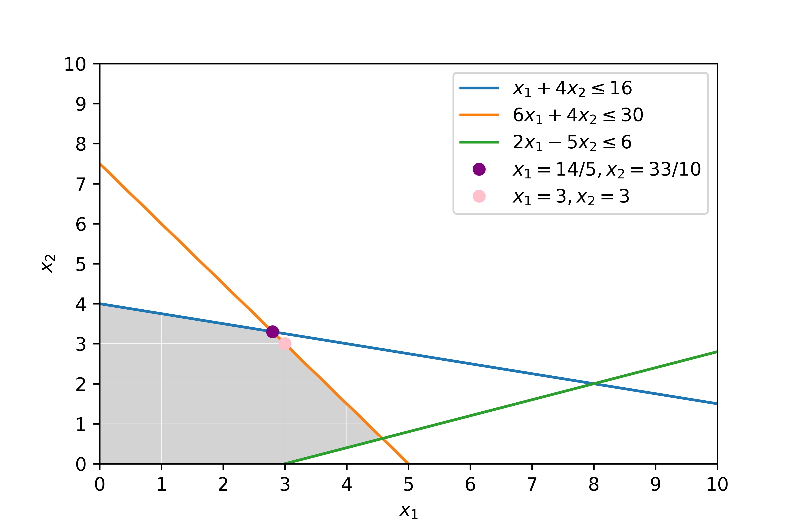

# Exercise 1

Consider the following optimization problem:

$$
\begin{aligned}
& {\text{minimize}}
& & f(x)=6x_1+5x_2\\
& \text{subject to}
& & x_1+4x_4\leq16 & \text{(i)}\\
& & & 6x_1+4x_2\leq30 & \text{(ii)}\\
& & & 2x_1-5x_2\leq6 & \text{(iii)}\\
& \text{and} 
& & x_1\geq0,x_2\geq 0
\end{aligned}
$$

a) Sketch the feasible set in 2 dimensions.

b) Write out the simplex tableaux for the problem and show the first step needed to bring in a new variable into the solution (e.g. argue what column and row to choose, and what elementary operations are needed for the first reductions). Find the maximum for $f$ on the feasible set (you may use MatLab).

[Online Simplex Solver](http://simplex.tode.cz/en/#steps)

> Simplex is a method for linear programming problems. It must be a **maximization** problem on standard form.
>
>- *All variables must be non-negative $\geq 0$.*
>- *Constraints should be non-negative $(\leq)$.*
>
>The objective function should have all the variables on the left-hand-side and is equal to zero e.g. $Z = 3x + 4y$ becomes $– 3x – 4y + Z =
0$.
>
>Simplex introduces slack variables to turn inequalities into equations e.g. $2x_1+x_2 \leq 8$ becomes $2x_1+x_2 + x_3=8$.
> **NB: Duality Theorem**
Primal Problem $P$
$$maximize\: f(x)=c^Tx\\Ax\leq b\\x\geq0$$
Dual Problem $P'$
$$minimize\: g(y)=b^Ty\\A^Ty\leq c\\y\geq0$$

<!-- A minimization problem can be rewritten as:
$$max\: f(x) = min\:-f(x)$$ -->

Once the above is satisfied the initial problem can be formulated on simplex tableau form:

|$x_1$|$x_2$|$\hat{x}_3$|$\hat{x}_4$|$\hat{x}_5$|  $M$  |  $y$   |
|-----|-----|-----|-----|-----|-----|-----|
|1|4|1|0|0|0|16|
|6|4|0|1|0|0|30|
|2|-5|0|0|1|0|6|
|-6|-5|0|0|0|1|0|
Table 1: Initial simplex tableau

> NB. eaxmple of dual problem see 18Exam.pdf

Selecting pivot element $A_{ij}$;

> The pivot column $j$ should be the largest negative i.e. smallest value of the bottom row $c$, which is the coefficients.
The pivot row should be the smallest value. The pivot row $i$ is determined by $\min(\frac{y_n}{c_n})$.  

Pivot column $j$;

$j=\min(c)=\min(-6,-5) \rightarrow j=1$ is selected.

Pivot row $i$;

$i=\min(\frac{16}{1}, \frac{30}{6}, \frac{6}{2})$

$i=3$ is selected as $\frac{6}{2}=3$ is the smallest entry.

The pivot element is $A_{13}$

> Next step: All other entries in the column should be 0

Row operations;

$3R_3-R_2$,
$\frac{1}{2}R_3-R_1$,
$3R_3+R_4$,
$\frac{1}{2}R_3$

|$x_1$|$x_2$|$\hat{x}_3$|$\hat{x}_4$|$\hat{x}_5$|  $y$   |
|-----|-----|-----|-----|-----|-----|
|0|13/2|1|0|-1/2|13|
|0|19|0|1|-3|12|
|1|-5/2|0|0|1/2|3|
|0|-20|0|0|3|18|
Table 2: Simplex after first pivot

> 18exam.pdf has a full simplex solution

$$f(\frac{14}{5},\frac{33}{10})=\frac{333}{10}\approx 33.3$$

c) Find the maximum point $(x_1,x_2)$ of $f$, when $x_1, x_2$ are both integers. Show your solution in the sketch from question a). Argue for your answer.

*IDK how to solve this, however a guess could be $(3,3)$. $(3,3)$ does satisfy the inequality and must be the solution I just don't know how to show it mathematically.*

# Exercise 2

Consider the function: $f:R^2 \rightarrow R$, where $f(x)=x_1\cdot x_2 - x_1$.

a) Find the gradient of $f$ and the directional derivate in the direction $d(1,1)$ in the point $(x_1,x_2)=(1,2)$. Argue for your calculations.

The gradient of $f$ is $\nabla f$, which is a vector of the partial derivates of the variables.

[Emath Help](https://www.emathhelp.net/calculators/calculus-3/gradient-calculator/?f=x*y-x&p=x%2Cy%3D1%2C2&steps=on) can solve first part i.e. the partial derivatives.

$$\nabla f(x_1,x_2)=
    \begin{bmatrix}
    \frac{\partial f}{\partial x_1} \\
    \frac{\partial f}{\partial x_2}
    \end{bmatrix}=
    \begin{bmatrix}
    x_2-1 \\
    x_1 
    \end{bmatrix}
$$

$$\nabla f(x_1,x_2)|_{(x,y)=(1,2)}=
    \begin{bmatrix}
    \frac{\partial f}{\partial x_1} \\
    \frac{\partial f}{\partial x_2}
    \end{bmatrix}=
    \begin{bmatrix}
    2-1 \\
    1 
    \end{bmatrix}
    = \begin{bmatrix}
    1 \\
    1 
    \end{bmatrix}
$$

The directional derivate in the direction d, is the dot product of $d \cdot \nabla f$.

$$d \cdot \nabla f(2,1) = 1 \cdot (2-1)+ 1\cdot 1 = 1$$

Now let $f$ be subject to the constraint, $h(x_1,x_2)=0$ where $h(x_1,x_2)=x_1^2+x_2^2-4$.

b) Find the maximum and minimum for $f$ in the feasible set $F=\{(x_1,x_2)|h(x_1,x_2)=0\}$
Argue for your calculations.

*To find both minimum and maximum of f subject to the constraint h I use the lagrange multiplier
method.*

$$F = \{x,\lambda\} = f(x) + \lambda (h(x))$$

*Putting in the above expression we get;*

$$F = \{x,\lambda\} = x_1\cdot x_2 - x_1 + \lambda (x_1^2+x_2^2-4)$$

*Removing the parenthesis following the lambda we get;*

$$F = \{x,\lambda\} = x_1\cdot x_2 - x_1 + \lambda\cdot x_1^2 + \lambda\cdot x_2^2 - \lambda\cdot 4)$$

We thereafter take the partial derivative of $x_1$, $x_2$ and $\lambda$

$$\frac {\partial f}{\partial x_1} = x_2 - 1 + \lambda \cdot 2x_1$$

$$\frac {\partial f}{\partial x_2} = x_1 + \lambda \cdot 2x_2$$

$$\frac {\partial f}{\partial \lambda} = x_1^2 + x_2^2-4$$

*Solving using Wolfram Alpha Linear Equation Solver yields 4 solutions;*

$$x_1=-1.076, x_2=1.686, \lambda =0.319$$

$$x_1=1.076, x_2=1.686, \lambda =-0.319$$

$$x_1=1.610, x_2=-1.186, \lambda =-0.679$$

$$x_1=-1.610, x_2=-1.186, \lambda =0.679$$

$$f(-1.076,1.686)=(-1.076) \cdot (1.686) -(-1.076) = - 0.738$$

$$f(-1.076,1.686)=(1.076) \cdot (1.686) -(1.076) = 0.738$$

$$f(1.610,-1.186)=(1.610) \cdot (-1.186) -(1.610) = -3.519$$

$$f(-1.610,-1.186)=(-1.610) \cdot (-1.186) -(1.610) = 3.519$$

*We conclude that if there are minimizer, then they are located at $(-1.076,1.686)$ and $(1.076,1.686)$ and if there are maximizers, then they are located at $(1.610,-1.186)$ and $(-1.610,-1.186)$.*

c) Argue that the maximum of $f$ on the set $D=\{(x_1,x_2)|h(x_1,x_2)\leq0\}$ is the maximum found in b) (Note: $D$ includes both the circle AND the interior of the circle).

*The circle and the interior of the circle forms the feasible set, thus the maximum of $f$ on $D$ will be the maximum of the circle, i.e. there are no points in the interior of the circle greater than points on the circle.*

# Exercise 3

a) In the context of optimization, is simulated annealing guaranteed to find the global optimum
(Yes/No)?

*No.*

> Simulated Annealing have countermeasures for getting stuck in local optimum, by accepting a worse candidate solution with some probability. Improving candidate solutions are always accepted. Simulated Annealing is inspired by metallurgy, where the blacksmith heath the metal material and lets it slowly cool off. It makes the metal easier to work with. Simulated annealing how the term of hot and cold. When it's hot, the algorithm is more likely to take a worse candidate solution, as it get colder the probability decrease i.e. it gets less bendy.

b) What is continuous optimization? (optional: you may give an example of a continuous optimization problem to help explain your answer).

*For continuos optimization the variables of the objective function must be continuos. It is important as the continuity assumption allow us to calculus methods. Discrete problems use discrete variables and tend to be harder to solve as these calculus method cannot be applied to function that are not continuous and form gaps and intervals.*

c) What does it mean if an optimization method is “stochastic”? Give one example of a stochastic optimization method we discussed in lectures.

*Stochastic also means random. The opposite term is deterministic. Deterministic optimization given some input $x$ is guaranteed to always output the same $y$. Stochastic methods does not provide such guarantee, however stochastic methods are presumably faster and more robust, as they have mechanism to avoid getting stuck in local minimums.*

d) Some optimization methods use a “population of candidates” during the search. What does this mean? Give one example of such an optimization method.

*A population of candidate is a way of spreading out the search field of an optimization algorithm. Instead of a single candidate, that either search along a line or random steps from the former solution, the population searches in many areas of the function at the same time.
Particle swam optimization is one such method. It spreads out a swarm of particles i.e. candidate solutions and in corporation they find an approximation of the global optimum.*

e) We are helping a cat find the warmest location in the room to have a sleep. Each location in the room is represented by two real coordinates $(x,y)$, and each location gives a heat score described by a function $f$. The distribution of heat across the room according to function $f$ is illustrated in the graphs below.

We want to use a particle swarm to find the warmest location in the room, i.e. the $(x,y)$ coordinates that have the highest “heat” score.

i) Develop a representation of a candidate solution as a “particle”, including a fitness function. The particle swarm update formula is:

The particle swarm has two update formulas one for particles velocity;

$$v_i(t+1)=wv_i(t)+c_1r_1[\hat{x}_i(t)-x_i(t)]+c_2r_2[g(t)-x_i(t)]$$

and one for particle position;

$$x_i(t+1)=x_i(t)+v_i(t+1)$$

The fitness function is the heat evaluated at $(x,y)$, which we seek to optimize.

$$h(x,y)$$

ii) What does “$v_i$” refer to in this formula?

*$v_i$ refers to the velocity of particle $i$ (is it in a certain direction?).*

iii) What does “$t$” refer to in this formula?

*$t$ refers to time, however for Particle Swarm Optimization time is represented as iteration.*

iv) Given an initial particle population $P$ of size $N$, describe the THREE main steps of your particle swarm search for ONE iteration (about one sentence per step).

> For each $p$ in $P$
>
> 1. Evaluate the fitness i.e. heat of particle $p$ as $h(x_i,y_i)$.
> 2. If $h(\hat{x_i},\hat{y_i}) < h(x_i,y_i)$
Then update the $p$ best know position $\hat{x_i}$ (cognitive component)
If $g(t) < h(x_iy_i)$
Then update the best known global position $g(t)$ (social component).
>3. Update the particles individual velocity and position according to the update formulas in (i).

# Exercise 4

## Question 1

In a two‐class classification problem, the distribution of the class‐conditional probabilities $p(x|ck)$, $k=1,2$ is given in Figure 1.

The number of samples in class 1 and class 2 is equal to 100 and 200, respectively.

a) Classify (using the trained classifier) the following vectors (test) samples: $x_1=3, x_2=7, x_3=8 $ and $x_4=9$

I classify to the largest probability;

$$x_1 \rightarrow c_1, x_2 \rightarrow c_1, x_3\rightarrow c_2, x_4\rightarrow c_2$$ 

b) Consider that the classification risk for the two classes is given by the matrix:
$$\Lambda=\begin{bmatrix}0 & 0.3 \\ 0.2 & 0\end{bmatrix}$$

where $\Lambda_{ij} = \lambda((\alpha_i|c_k)$ is the risk of taking action $\alpha_i$ while the correct class is $c_k$. What is the classification result for the (test) samples $x_i, i=1,...,4$?

$$R(\alpha_1|x)=\lambda (\alpha_1|c_1)P(c_1|x)+\lambda (\alpha_1|c_2)P(c_2|x)$$

I compute for each class as follows;

$$R(\alpha_1|x_1)=0\cdot0.1+0.3\cdot0 = 0$$

$$R(\alpha_1|x) = [0, 0.0015, 0.03, 0.06]$$

$$R(\alpha_2|x) = [0.02, 0.02, 0.004, 0]$$

I classify them as follows;

$$x_1 \rightarrow c_1, x_2 \rightarrow c_1, x_3\rightarrow c_2, x_4\rightarrow c_2$$

## Question 2

The two classes of a binary classification problem are formed by the blue and red samples plotted in Figure 2.

a) Describe how we can use a Generalized Linear Discriminant Function in order to classify the test samples (plotted as black dots) using a linear classifier.

*Linear Discriminant functions discriminates classes by a hyperplane. It work well when data is linearly separable, however this is not the case. With Generalized Linear Discriminant functions one can create a decision function in higher dimension $R^D$. The decision function corresponds to a non-linear one in $R$.*

b) Write two data transformations that can be used for the application of the process in a).

***Feature expansion**: We augment our data representation of $x$ in $R$ to $\phi$ in $R^3$.*
$$\phi=[1, x_1, x^2]^T$$
*We can then define a linear decision function in $R^3$.*

$$g(y)=W^T\phi$$

In this case data is described by two features $x=[x_1, x_2]^T$in $R^2$. It can be mapped to $R^3$ in the form:

$$\phi=[x_1, x_2, x_1^2, x_2^2]^T$$

*The above is computationally expensive to map all data points into higher dimension: It can also be difficult to control as dimensions increase, then polynomial increases wildly in complexity.*

***Kernel trick**: The kernel tricks computes the inner product vector in a higher dimensional space and saves a lot of effort mapping to higher dimensions, create a linear decision function and project is back onto the original space. There exist a multitude of kernel function, e.g. Radial Basis Kernel, that lets one compute the squared euclidean distance in higher dimensions.*

> Suppose we have a mapping $\phi:R^n\rightarrow R^m$ that brings our vectors in $R^n$ to some feature space $R^m$. Then the dot product of $x$ and $y$ in this space is $\phi(x)^T\phi(y)$. A kernel is a function $k$ that corresponds to this dot product, i.e. $k(x,y)=\phi(x)^T\phi(y)$.

c) For each of the data transformations described in question (b), draw the transformed training data
and the decision function.

My idea for both transformations and decision functions are more or less the same, so only one drawing is made. Feature expansion would actually create the model on the left, and then project it to the model on the right. Kernel tricks would just compute the inner product to use in the classifier and avoid the tedious mapping.

## Question 3

a) Draw a neural network solving a 5‐class classification problem using training data $x \in R^5, i\:\:1, ... , N$. The neural network is formed by 2 hidden layers.

*Number neurons in hidden layers is selected according to Jeff Heaton's rule of thumb stated as;*

> The number of hidden neurons should be 2/3 the size of the input layer, plus the size of the output layer.

$$5\cdot\frac{2}{3}+5\approx8$$

b) Express the output of the network $o$ with respect to the input vector $x$ and describe the classification rule based on which $x$ will be assigned to one of the 5 classes.

c) Show that the use of the linear activation function (for all layers) makes the above network equivalent to a two‐layer (no hidden layers) network.

d) Based on the above, describe why it is important to use non‐linear activation functions in neural networks.
